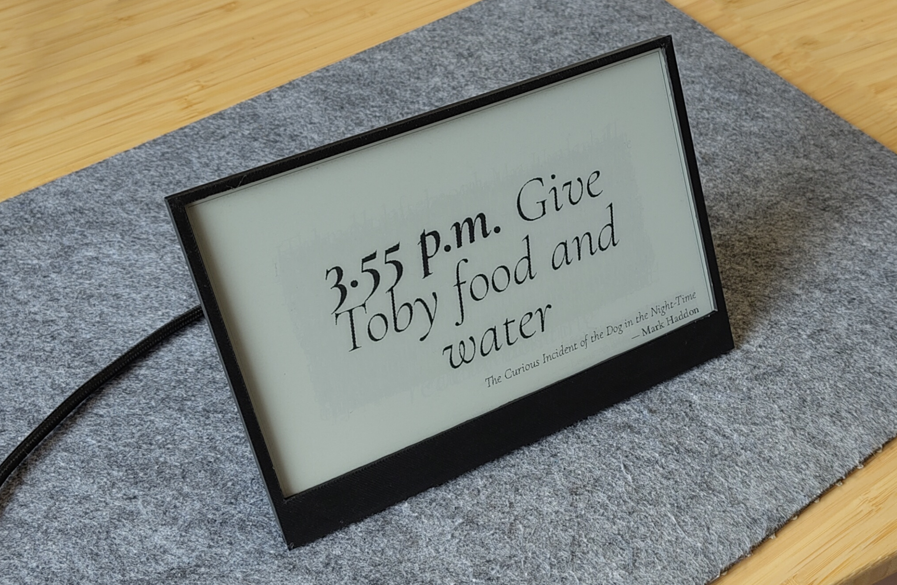

# :clock10: Time Teller's website

🚀 <a href="https://time-teller.arthurgassner.ch"><strong>live website</strong></a> 🚀

This repo contains the code for the _Time Teller_'s website.

It is built using Material for MkDocs. 

> [!NOTE]  
> The code for the software powering the screen can be found [here](https://github.com/arthurgassner/time-teller).

## How to install 

1. Install [uv](https://docs.astral.sh/uv/) 
2. Create a venv with `uv venv`
3. Install dependencies with `uv pip install -r requirements.txt`

## How to run

To run it, run `source .venv/bin/activate && mkdocs serve`.
