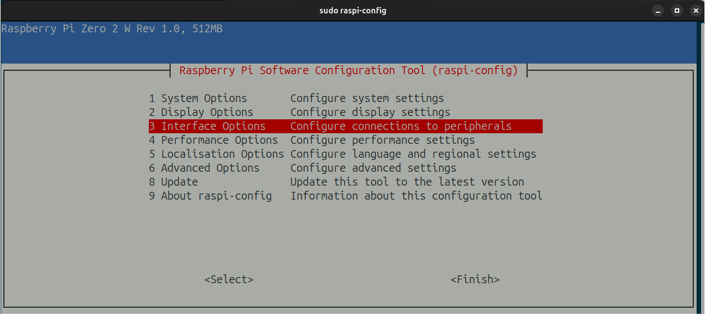

# How to build it

## Introduction

The idea of having a sentence-based clock had been floating around in my head for a while.[^1] I eventually stumbled upon [this dataset](https://github.com/JohannesNE/literature-clock/blob/master/litclock_annotated.csv), and figured I'd build one.

Cue to some building.

[^1]: I assume I'd stumbled upon [one](https://literature-clock.jenevoldsen.com/) [of](https://www.authorclock.com/) [these](https://www.reddit.com/r/somethingimade/comments/xcbwpx/i_made_a_literary_quote_clock_out_of_an_old/) at some point.

## Step 1: Gather the necessary parts

First, I listed all things I'd expect to need -- naturally amending that list as I kept on building. Exhaustively:


| Part                                      | Description                                        | Price [CHF] |
| ----------------------------------------- | -------------------------------------------------- | ----------- |
| **Waveshare's 7.5inch e-Paper screen**    | Our screen                                         |     60      |       
| **Raspberry Pi Zero 2W**                  | To drive our screen.                               |     20      |       
| **Micro SD card**                         | To house the RPi's OS.                             |     10      |       
| **Waveshare's 7.5inch e-Paper HAT**       | To act as a bridge between our RPi and screen.     |     20      |       
| **USB cable Type C**                      | To power our RPi.                                  |     10      |       
| **3D-printed case**                       | To house everything.                               |     ~30     |       
| **Threaded inserts & screws**             | To hold everything together.                       |     ~3     |       
| **Female USB-C to Micro USB connector**   | To avoid using Micro USB.                          |     ~5     |       


<figure markdown="span">
  { width="100%" }
  <figcaption>Most of the required hardware.</figcaption>
</figure>

## Step 2: Setup the RPi

First, I needed to setup the freshly-opened RPI Zero 2W.
I flashed it -- thereby installing Raspberry Pi OS (64bit), based on Debian -- by following the [official guide](https://www.raspberrypi.com/software/).

!!! warning
    
    Make sure to flash your WiFi credentials and [SSH public key](https://docs.github.com/en/authentication/connecting-to-github-with-ssh/generating-a-new-ssh-key-and-adding-it-to-the-ssh-agent) onto the board, allowing you to easily SSH into it later.

<figure markdown="span">
  { width="100%" }
  <figcaption>Flashing the RaspberryPi Zero 2W.</figcaption>
</figure>

Once flashed and booted, the newly-installed RPi will automatically connect to my WiFi.
I can then figure out its local IP address with `sudo arp-scan --localnet`.

<figure markdown="span">
  { width="100%" }
  <figcaption>Attempting to SSH into each local addresses, till I find the RPi.</figcaption>
</figure>

Once I'm in, the first thing to do is to update its software with `sudo apt update && sudo apt upgrade`. 

??? tip "Making the shell more pleasant"
    
    Whenever I install some Debian-based OS, I start by installing [`oh-my-zsh`](https://ohmyz.sh/) -- along with [`fzf`](https://github.com/junegunn/fzf), [`zsh-syntax-highlighting`](https://github.com/zsh-users/zsh-syntax-highlighting) and [`zsh-autosuggestions`](https://github.com/marlonrichert/zsh-autocomplete) -- making the entire shell-based interaction much more pleasant.

I can now turn off the RPi, and hook the RPi to the HAT, and the HAT to the screen.

<figure markdown="span">
  { width="100%" }
  <figcaption>Raspberry Pi Zero 2W, connected to our HAT, and HAT to the e-Paper screen.</figcaption>
</figure>

Following [Waveshare's wiki](https://www.waveshare.com/wiki/7.5inch_e-Paper_HAT_Manual#Working_With_Raspberry_Pi), we need to enable our RPi's _Serial Peripheral Interface_ (SPI), so that it can talk to our HAT -- with `sudo raspi-config` > `Interface Options` > `SPI`.

<figure markdown="span">
  { width="100%" }
  <figcaption>Enable our RPI's SPI, so that it can talk to our HAT.</figcaption>
</figure>

## Step 3: Display something on the screen

Let's write some code!

Since the code we'll write will be running directly on our RPi, it's preferable to write -- and test it -- directly on our headless board. Luckily, VSCode -- and most IDEs -- [supports this by default](https://code.visualstudio.com/docs/remote/remote-overview), allowing me to edit on my computer the files on our RPi.

??? tip "Using git on a remote machine"

    Since I'm versioning my code -- via git -- and hosting it on GitHub, I'd like to have an easy way of authentifying my remote machine -- i.e. my RPi.
    [Deploy keys](https://docs.github.com/en/authentication/connecting-to-github-with-ssh/managing-deploy-keys) allow me to do just that, basically enabling my RPi to push/pull from my GitHub repo.

Now e-ink technology is quite peculiar, in that it has a very high refresh time (~4s for our screen), and two types of refresh, namely

- **Full-refresh**: The entire screen is refreshed at once, quite noticeably.
- **Partial-refresh**: Only a part of the screen is refreshed at once, discretely. The downside is that a part of the previous image is usually visible, leading to a "dirty-looking" screen after a while.

After diving through [Waveshare's demo codes](https://github.com/waveshareteam/e-Paper) and [Waveshare's wiki](https://www.waveshare.com/wiki/7.5inch_e-Paper_HAT_Manual#Working_With_Raspberry_Pi), and struggling to figure out what code was actually needed, I managed to display `Hello World` onto the screen. The full Python code is available [here](https://github.com/arthurgassner/literature-clock/blob/main/hello_world.py).

<figure markdown="span">
  { width="100%" }
  <figcaption>Displaying <code>Hello World</code> on our screen.</figcaption>
</figure>


Wonderful! I can now work my software magic and end up with a small Python script which fetches the time-accurate quote, builds a nice-looking image of it, and display it onto the screen. Using [`cron`](https://en.wikipedia.org/wiki/Cron), I can setup my RPi to run that script every minute, and _tada_! A clock!

??? tip "Using `cron` to run my script every minute."

    I can set it up by running `crontab -e`, and then adding the line
    
    ```bash
    * * * * * cd /home/pi/literature-clock && /home/pi/literature-clock/.venv/bin/python /home/pi/literature-clock/main.py
    ```

<figure markdown="span">
  { width="100%" }
  <figcaption>The e-ink screen passing from 21:<b>17</b> to 21:<b>18</b>.</figcaption>
</figure>

But what happens if my RPi loses power?
The RPi would shut down, and the currently-displayed quote would stay on the screen.
However, upon powering it up, I'd have to wait for `cron` job to run again, i.e. up to a _whole_ minute.

Instead, I want my script to run on startup. To do so, we'll use [`systemd`](https://systemd.io/), leading us to write [`literature-clock.service`](https://github.com/arthurgassner/literature-clock/blob/main/literature-clock.service).

I place our newly-written `.service` file at `/etc/systemd/system/literature-clock.service`, register it, and, and enable it to run at boot.

```bash
sudo nano /etc/systemd/system/literature-clock.service # Write the .service 
sudo systemctl daemon-reload # Register it
sudo systemctl enable literature-clock.service # Enable it
```

??? tip "Test the `systemd` service"

    - Ensure the service works with `sudo systemctl start literature-clock.service`
    - Check the service's status with `systemctl status literature-clock.service`


## Step 4: House the hardware properly

We now have a working clock -- yet fully naked on my desk.
I turn to a 3D modelling software -- [solvespace](https://solvespace.com), as I am a Linux user -- to draw what I'd see as a nice-looking housing.[^2]

[^2]: The 3d files can be found [here](https://github.com/arthurgassner/literature-clock/tree/main/3d-models)

<figure markdown="span">
  { width="100%" }
  <figcaption>Our clock -- front and back -- as seen in Solvespace.</figcaption>
</figure>

After some 3D-printing, our parts are ready for assembly.

!!! note "3D printing as a service vs at home"

    At the start of this project, I didn't own a 3D printer, leading me to rely on print-as-a-service vendors.
    The lead time (typically 7-10 days) eventually led me to buy my own 3D printer, to be able to experiment faster.


After inserting the [threaded inserts](https://en.wikipedia.org/wiki/Threaded_insert) -- with a soldering iron -- and mounting the female-USB-C-to-male-micro-USB port, _tada!_, our clock is ready !

<figure markdown="span">
  { width="100%" }
  <figcaption>Our clock, just before the assembly.</figcaption>
</figure>

<figure markdown="span">
  { width="100%" }
  <figcaption>Fully-assembled literature clock.</figcaption>
</figure>
